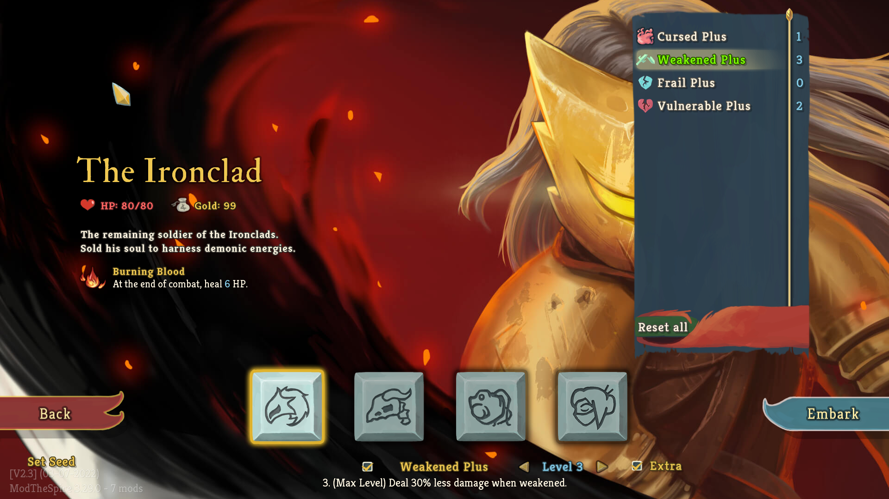

# Ascension Manager
Ascension Manager is a framework meant to ease the creation of custom ascension/difficulties by removing the selection and rendering aspects in the main menu. 
This also makes it possible to download and use multiple mods simultaneously without conflict. Its presentation is similar to that of Hades' heat system.

Check out the [wiki](https://github.com/FearOfMonday/AscensionExtra/wiki) tab for how to use it

NOTE: Currently most buttons are created via Basemods ClickableUIElement, which means that controller is currently not supported (I think?).
I might update this in the future, but currently I do not have a controller for my computer so I cannot do any testing. Also who plays STS with a controller anyways?
